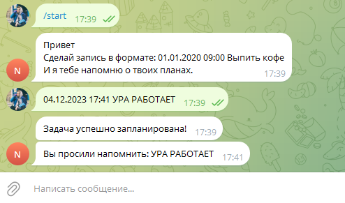

### (RU)
## Название проекта: Телеграм бот заметок
  
---
* Функциональные возможности проекта: В этом проекте telegram-бот способен запоминать ваше сообщение и присылать его в telegram в то время, на какое вы запланировали. 
* В проекте реализованы следующие технологии: Spring framework, Maven,PostgreSQL, Liquibase Java Telegram bot API
* Язык программирования: Данный проект написан на языке программирования Java.

 ------

## Запуск приложения
- Откройте проект в вашей IDE;
- В конфигурационном файле application.properties укажите ваши данные для доступа к базе данных;
- Укажите токен Telegram бота, на котором хотите запустить приложение.
  Для этого зайдите в свою IDE, нажмите на вкладку Run, выберите Edit Configurations.
  Появится окно, в нем нажмите Modify options и выберите Add VM options.
  Появится новое поле, в котором введите -Dtelegram.bot.token= и вставьте ваш токен.
  Примените введенные значения путем нажатия на кнопку apply и Ok.
- Запустите метод main в файле SuperNoteBotApplication.java;
- Готово!
---

